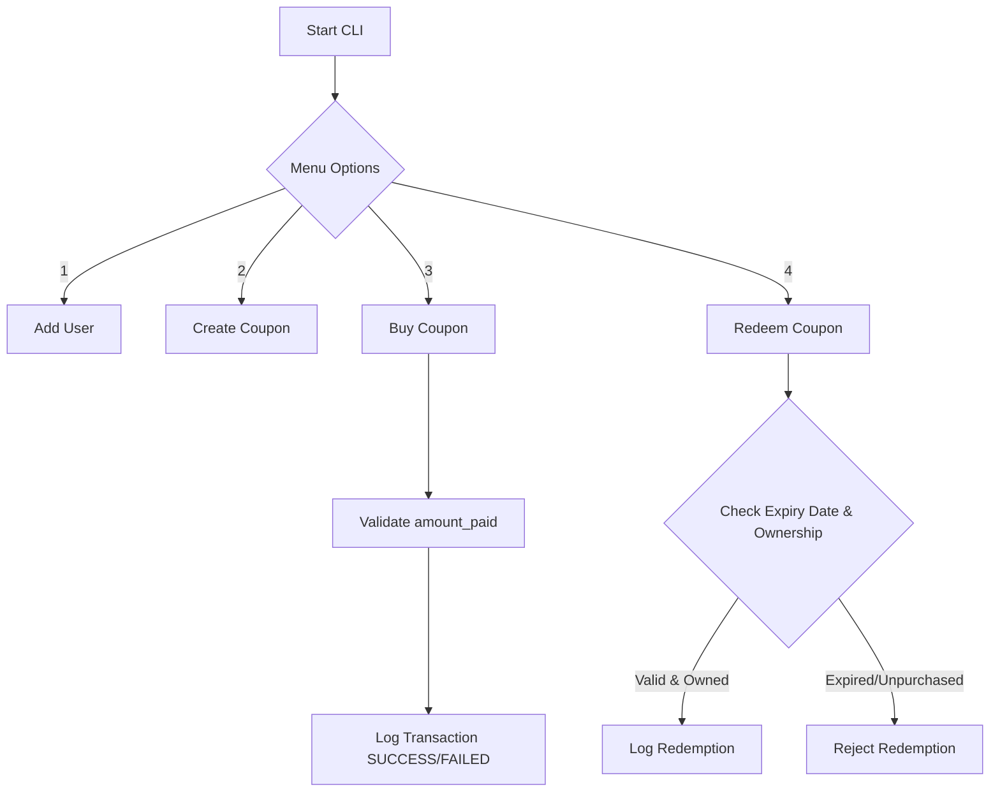

# CouponHub - PyMySQL Project

A beginner-friendly Command Line Interface (CLI) application demonstrating relational database management, payment tracking, and modular Python development.

## Setup Instructions
1. Clone this repository.
2. Install dependencies: `pip install pymysql python-dotenv` (Create Virtual Environment (optional))
3. Copy `.env.example` to a new file named `.env` and fill in your database credentials.
4. Execute the SQL schemas provided in the `database_schema.sql` file in your MySQL environment.
5. Run the application: `python main.py`

## Application Flow
This flowchart illustrates the application's core loop, highlighting the strict separation between purchasing a coupon and redeeming it.

